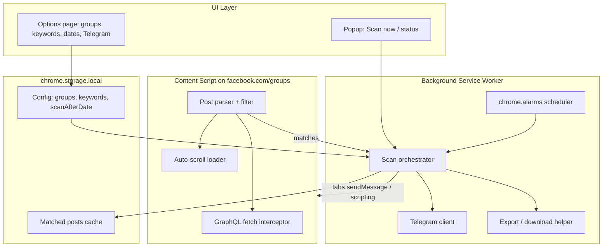
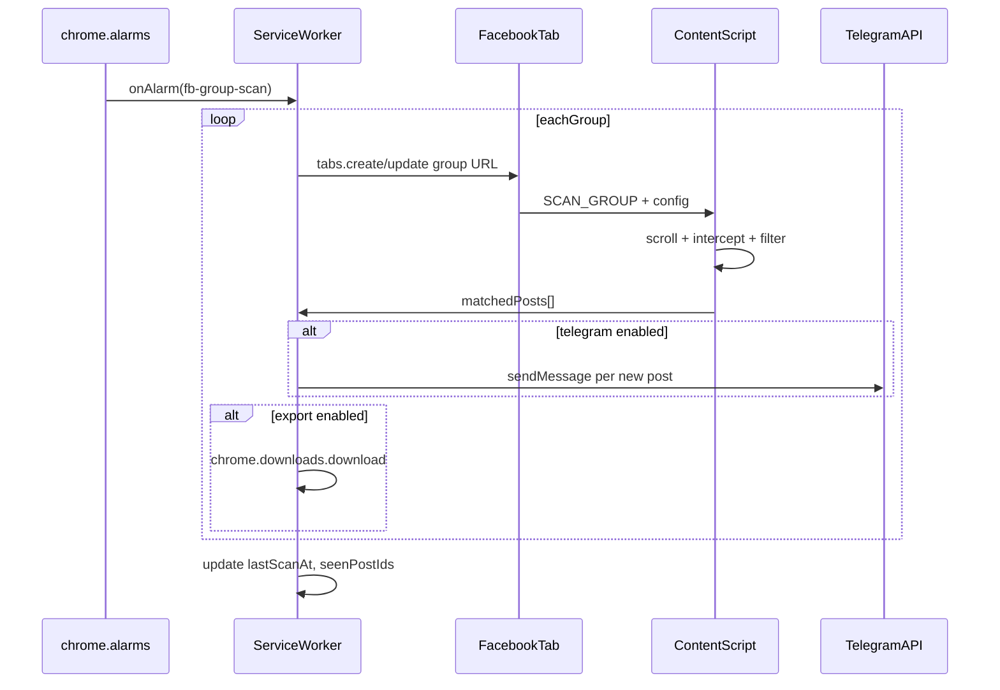

# Facebook Group Post Scanner — Chrome Extension Plan

## Goal

A **Chrome/Edge MV3 extension** (TypeScript + Vite build) that:

- Scans posts from a **user-configured list of Facebook groups**
- Filters by **keywords** (e.g. `Java`, `Backend`) and **scan-after date** (only posts on or after that date)
- On match: **download** results (JSON/CSV) and/or **send to Telegram bot**
- Supports **manual scan** (popup) and **scheduled auto-scan** (alarms)

## Important constraints


| Topic          | Implication                                                                                                                                          |
| -------------- | ---------------------------------------------------------------------------------------------------------------------------------------------------- |
| Facebook API   | No public API for arbitrary group feeds. The extension will **scrape while you are logged in** (DOM + internal GraphQL responses on `facebook.com`). |
| Scheduled scan | `chrome.alarms` only fires when Chrome is running. User must stay **logged into Facebook**.                                                          |
| Terms of use   | Scraping may violate Facebook ToS. Plan includes polite delays and user-only data access; use at your own risk.                                      |
| Telegram       | Bot token + chat ID stored in `chrome.storage.local` (never synced). Calls go from the **service worker** (no CORS block).                           |


## Architecture




## Project structure (greenfield in workspace)

```
fb-group-scanner/
├── package.json
├── tsconfig.json
├── vite.config.ts          # build popup, options, background, content scripts
├── src/
│   ├── manifest.json       # MV3: permissions, host_permissions
│   ├── background/
│   │   └── service-worker.ts
│   ├── content/
│   │   └── facebook-scraper.ts
│   ├── popup/
│   │   ├── index.html
│   │   ├── popup.ts
│   │   └── popup.css
│   ├── options/
│   │   ├── index.html
│   │   ├── options.ts
│   │   └── options.css
│   └── shared/
│       ├── types.ts
│       ├── storage.ts
│       ├── keyword-matcher.ts
│       ├── date-filter.ts
│       ├── telegram-client.ts
│       └── export.ts
└── dist/                   # load unpacked in chrome://extensions
```

## Core modules

### 1. Configuration (`shared/types.ts`, `shared/storage.ts`, Options UI)

**Stored config shape:**

```typescript
interface ScannerConfig {
  groups: { id: string; name: string; url: string }[];
  keywords: string[];              // case-insensitive, OR match
  scanAfterDate?: string;          // ISO date (YYYY-MM-DD) — only posts on or after this date
  schedule: { enabled: boolean; intervalMinutes: number };
  telegram: { enabled: boolean; botToken: string; chatId: string };
  export: { enabled: boolean; format: 'json' | 'csv' };
  scanBehavior: { maxScrolls: number; scrollDelayMs: number };
}
```

**Scan-after date behavior:**

- User sets one date, e.g. `2025-06-01` → extension includes posts where `createdAt >= 2025-06-01 00:00:00` (local timezone)
- If **not set**, all loaded posts are eligible (keyword filter still applies)
- Example: scan after `2025-06-20` → posts from June 20 onward match; older posts are skipped

**Options page** (`[src/options/options.ts](src/options/options.ts)`):

- Add/remove group URLs (normalize to `https://www.facebook.com/groups/{id}`)
- Keyword chips input
- **"Scan posts after"** date picker (single field, with clear/reset button)
- Helper text: *"Only posts published on or after this date will be scanned."*
- Telegram: bot token, chat ID, test button
- Schedule toggle + interval (e.g. 30 / 60 / 120 min)
- Save → `chrome.storage.local`

### 2. Facebook scraping (`src/content/facebook-scraper.ts`)

**Strategy (most stable for FB):** inject a **fetch/XHR interceptor** on group pages to capture GraphQL feed payloads, with **DOM fallback** if structure changes.

**Flow:**

1. Background opens or focuses a tab per group URL (or user is already on group page for manual scan)
2. Content script receives `SCAN_GROUP` message with config
3. Auto-scroll feed (`maxScrolls` × `scrollDelayMs`) to load posts
4. Parse each post: `id`, `text`, `author`, `permalink`, `createdAt`, `attachments[]`
5. Apply filters:
  - `[date-filter.ts](src/shared/date-filter.ts)`: skip posts where `createdAt < scanAfterDate` (start of day)
  - `[keyword-matcher.ts](src/shared/keyword-matcher.ts)`: any keyword in title+body (case-insensitive)
6. **Early stop:** when scrolling, if consecutive posts are all older than `scanAfterDate`, stop scrolling (saves time vs loading entire group history)
7. Return matched posts to service worker

**Manual scan:** popup button → `chrome.runtime.sendMessage({ type: 'SCAN_NOW', groupUrl? })`  
**Scheduled scan:** `chrome.alarms.onAlarm` → loop all configured groups sequentially with delay between tabs

### 3. Background orchestrator (`src/background/service-worker.ts`)

Responsibilities:

- Register/clear alarm when schedule config changes
- Open tab → `chrome.scripting.executeScript` or `tabs.sendMessage` to run scraper
- Deduplicate by post ID (skip already-sent via `seenPostIds` in storage)
- Dispatch matches to Telegram and/or trigger download
- Broadcast progress to popup (`SCAN_PROGRESS`, `SCAN_DONE`)

### 4. Telegram integration (`src/shared/telegram-client.ts`)

```typescript
// POST https://api.telegram.org/bot{token}/sendMessage
// Body: { chat_id, text, disable_web_page_preview: false }
```

Message template per match:

```
[FB Group] {groupName}
Keyword: {matchedKeywords}
Date: {createdAt}
Author: {author}
{text}
Link: {permalink}
```

Optional: `sendPhoto` / `sendDocument` if post has image/PDF attachment URL.

**Test button** in options sends a ping message to verify token + chat ID.

### Date filter detail (`shared/date-filter.ts`)

```typescript
// Returns true if post should be included
function isPostAfterDate(createdAt: Date, scanAfterDate?: string): boolean {
  if (!scanAfterDate) return true;
  const cutoff = startOfDay(parseISO(scanAfterDate)); // local TZ, 00:00:00
  return createdAt >= cutoff;
}
```

**Examples:**

- `scanAfterDate = 2025-06-20`, post on `2025-06-25` → **included**
- `scanAfterDate = 2025-06-20`, post on `2025-06-20` → **included** (same day counts)
- `scanAfterDate = 2025-06-20`, post on `2025-06-19` → **skipped**
- `scanAfterDate` empty → **included** (date filter off; keywords still apply)

### 5. Export (`src/shared/export.ts`)

- **JSON:** full matched post objects
- **CSV:** columns `group, date, author, keywords, text, link`
- Use `chrome.downloads.download()` with Blob URL from service worker
- Filename: `fb-scan-{group}-{timestamp}.json|csv`

### 6. Popup UI (`src/popup/popup.ts`)

- Show last scan time + match count
- Display active **scan-after date** (or "All dates" if unset)
- **Scan current group** (if active tab is a group page)
- **Scan all groups** button
- Link to Options page
- Live progress bar during scan

## Manifest V3 essentials (`[src/manifest.json](src/manifest.json)`)

```json
{
  "manifest_version": 3,
  "permissions": ["storage", "alarms", "tabs", "scripting", "downloads", "notifications"],
  "host_permissions": ["https://www.facebook.com/*", "https://api.telegram.org/*"],
  "background": { "service_worker": "background/service-worker.js" },
  "content_scripts": [{
    "matches": ["https://www.facebook.com/groups/*"],
    "js": ["content/facebook-scraper.js"],
    "run_at": "document_idle"
  }],
  "action": { "default_popup": "popup/index.html" },
  "options_page": "options/index.html"
}
```

## Build toolchain

- **Vite** + `@crxjs/vite-plugin` (or `vite-plugin-web-extension`) for MV3 bundling
- **TypeScript** strict mode
- Scripts: `npm run dev` (watch), `npm run build` → `dist/`
- Load unpacked: `chrome://extensions` → Developer mode → Load unpacked → `dist/`

## Scan sequence (scheduled)




## Implementation phases

### Phase 1 — Scaffold

- Init npm project, Vite + TS + CRX plugin
- Manifest, empty popup/options, storage helpers, types

### Phase 2 — Config UI

- Options page: groups, keywords, **scan-after date** picker, Telegram fields, schedule
- Persist + load config; alarm sync on save

### Phase 3 — Scraper

- Content script: scroll loader + GraphQL interceptor + DOM fallback parser
- `scanAfterDate` filter + early-stop on scroll when posts are too old
- Keyword filter; unit tests for matcher + date-after logic (Node test runner)

### Phase 4 — Orchestration

- Manual scan from popup (current tab + all groups)
- Background scan loop with dedup (`seenPostIds`)
- Progress events to popup

### Phase 5 — Output

- Telegram client + test button
- JSON/CSV export via `chrome.downloads`
- Desktop notification on scan complete (optional)

### Phase 6 — Polish

- Error handling (not logged in, private group, rate limit)
- README: install, Telegram bot setup, limitations

## Telegram bot setup (for user docs)

1. Message [@BotFather](https://t.me/BotFather) → `/newbot` → copy token
2. Get chat ID: message the bot, then open `https://api.telegram.org/bot<TOKEN>/getUpdates`
3. Paste token + chat ID in extension Options → Test → Save

## Risks and mitigations


| Risk                        | Mitigation                                                                       |
| --------------------------- | -------------------------------------------------------------------------------- |
| Facebook DOM/API changes    | Dual strategy: GraphQL intercept + DOM fallback; centralize selectors            |
| Duplicate Telegram messages | Persist `seenPostIds` per group in storage                                       |
| MV3 service worker sleep    | Keep scans short; use alarms not `setInterval`                                   |
| Too aggressive scrolling    | Configurable `maxScrolls` + `scrollDelayMs` defaults (e.g. 20 scrolls, 2s delay) |


## Out of scope (v1)

- Firefox port (can add later with `webextension-polyfill`)
- Cloud backend / multi-user sync
- Facebook login automation (user must log in manually)
- Scanning groups user is not a member of

